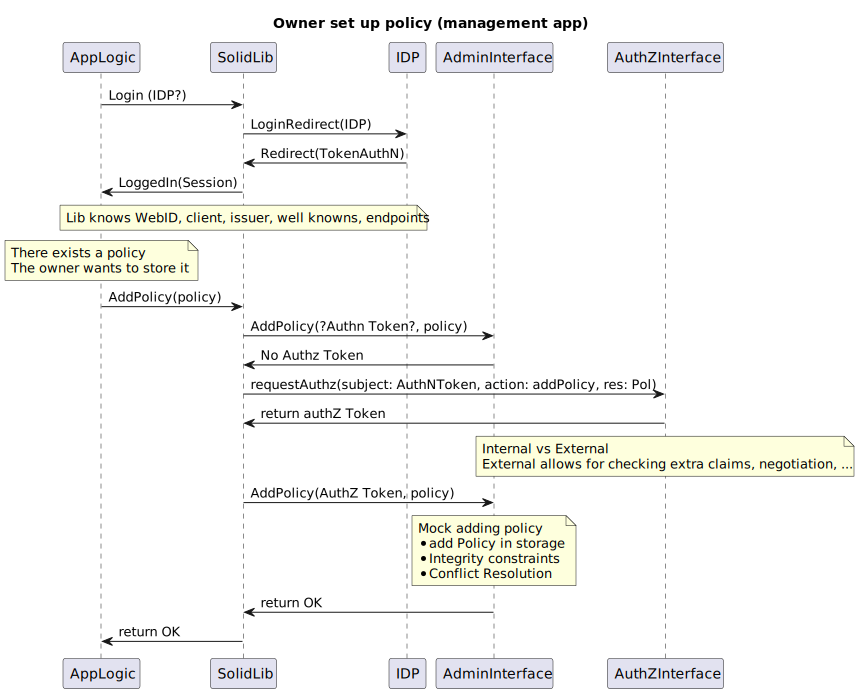
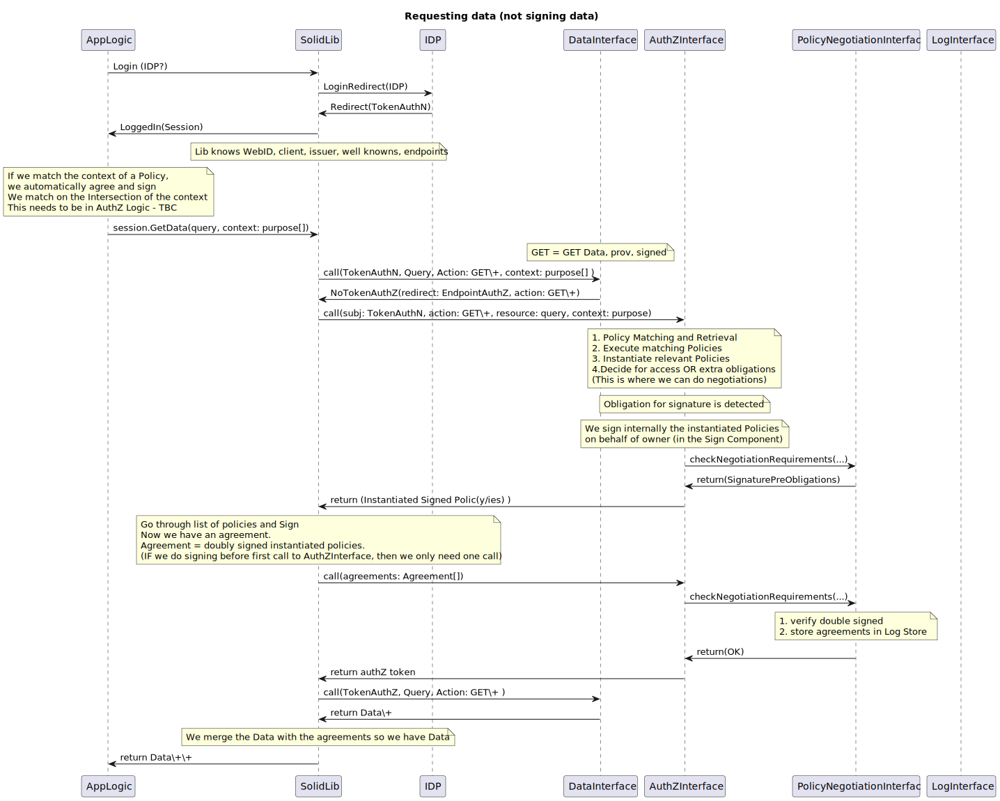

# Vienna-2023

## UML sequence diagrams

Can be online visualised via [sequencediagram.org](https://sequencediagram.org/) or with the vscode extension [PlantUML](https://plantuml.com/).

### Owner set up a policy



### Shop gets data (data not signed)



How to run

```sh
npm i
```

Start the AuthZ server

```sh
npx ts-node src/AuthZ/AuthZServer.ts
```

SolidLib shop gets data flow

```sh
npx ts-node test.ts
```